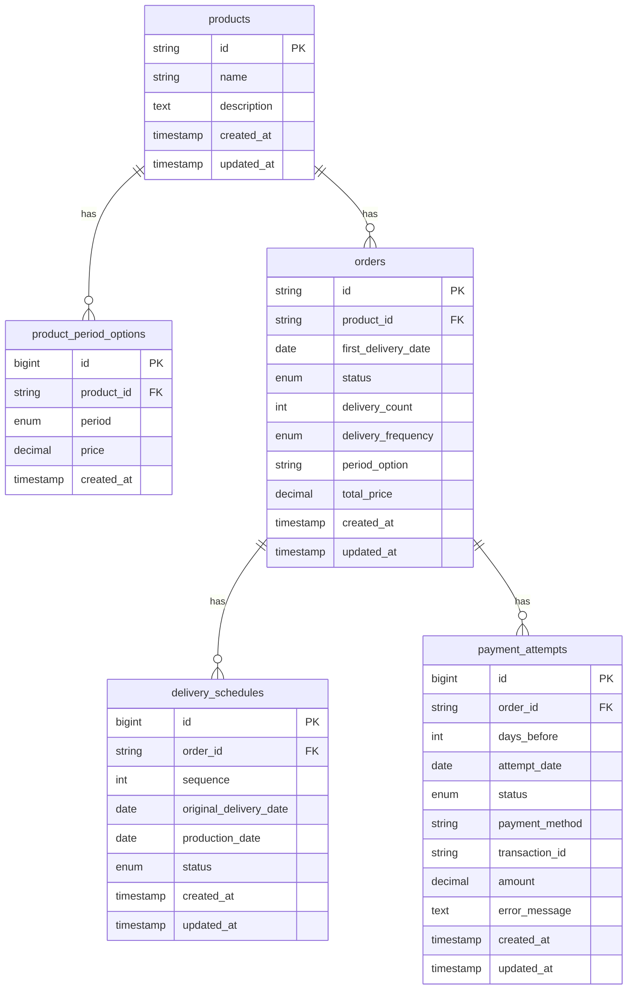

# 엔티티 관계 다이어그램 (ERD)

## Mermaid 다이어그램

## 테이블 관계 설명

### 1. products ↔ product_period_options
- **관계**: 1:N (One-to-Many)
- **설명**: 하나의 상품은 여러 개의 기간 옵션을 가질 수 있습니다.
- **외래 키**: `product_period_options.product_id` → `products.id`
- **삭제 규칙**: CASCADE (상품 삭제 시 옵션도 함께 삭제)

### 2. products ↔ orders
- **관계**: 1:N (One-to-Many)
- **설명**: 하나의 상품에 대해 여러 주문이 생성될 수 있습니다.
- **외래 키**: `orders.product_id` → `products.id`
- **삭제 규칙**: RESTRICT (주문이 있는 상품은 삭제 불가)

### 3. orders ↔ delivery_schedules
- **관계**: 1:N (One-to-Many)
- **설명**: 하나의 주문은 여러 개의 배송 스케줄을 가집니다.
- **외래 키**: `delivery_schedules.order_id` → `orders.id`
- **삭제 규칙**: CASCADE (주문 삭제 시 배송 스케줄도 함께 삭제)
- **제약 조건**: `(order_id, sequence)` UNIQUE

### 4. orders ↔ payment_attempts
- **관계**: 1:N (One-to-Many)
- **설명**: 하나의 주문에 대해 여러 번의 결제 시도가 있을 수 있습니다.
- **외래 키**: `payment_attempts.order_id` → `orders.id`
- **삭제 규칙**: CASCADE (주문 삭제 시 결제 시도 기록도 함께 삭제)

## 주요 인덱스

### products
- `created_at`: 상품 생성일 기준 정렬/조회

### orders
- `product_id`: 특정 상품의 주문 조회
- `status`: 주문 상태별 조회
- `created_at`: 주문 생성일 기준 정렬/조회
- `first_delivery_date`: 첫 배송일 기준 조회

### delivery_schedules
- `order_id`: 특정 주문의 배송 스케줄 조회
- `(order_id, sequence)`: 주문별 회차 조회
- `original_delivery_date`: 배송예정일 기준 조회
- `production_date`: 생산기준일 기준 조회

### payment_attempts
- `order_id`: 특정 주문의 결제 시도 조회
- `attempt_date`: 결제 시도일 기준 조회
- `status`: 결제 상태별 조회

